# Домашнее задание 3

> **чек-листы** на проект [VK Реклама](https://ads.vk.com)

## Центр коммерции

> Ссылка на страницу центра коммерции: https://ads.vk.com/hq/ecomm/catalogs

### Главная 

1. **Центр коммерции**. При нажатии на кнопку *"Создать каталог"* в правой части экрана открывается модальное окно с формой создания нового каталога.

  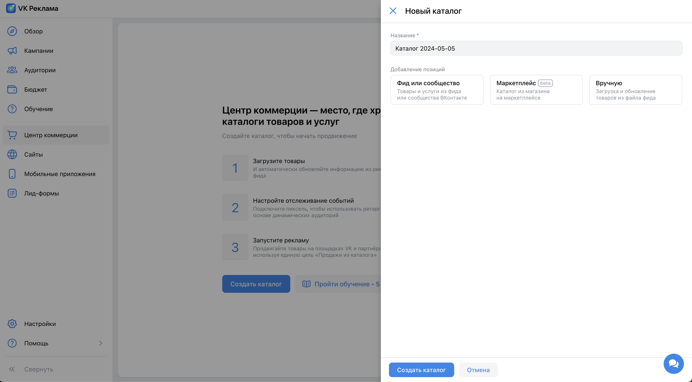

2. **Центр коммерции**. При нажатии на кнопку *"Крестик"* или *"Отмена"* в модальном окне оно закрывается.

  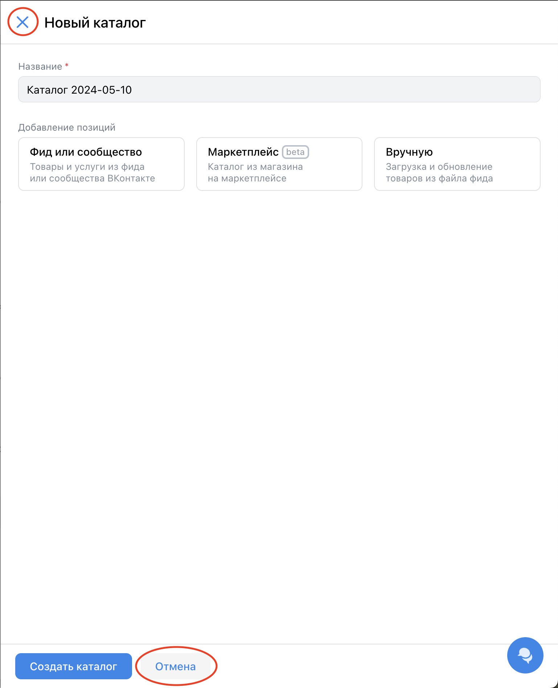

3. **Центр коммерции**. При нажатии на кнопку *"Пройти обучение"* открывается модальное окно с тремя вариантами обучения: *"Создать каталог с подсказками"*, *"Смотреть видеоурок от экспертов VK"*, *"Смотреть курс на обучающей платформе"*.

  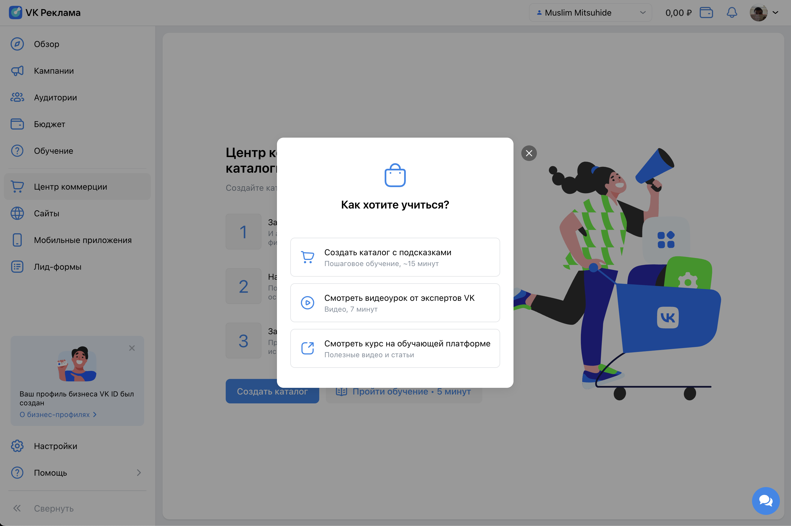

4. **Центр коммерции**. При нажатии на кнопку *"Крестик"* рядом с модальным окном оно закрывается.

  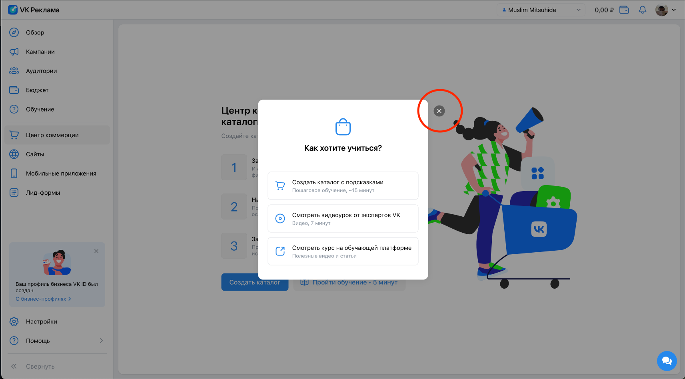

### Новый каталог

1.1. **Центр коммерции**. **Новый каталог**. При вводе в инпут-поле *"Название"* пустой строки и дальнейшем нажатии на кнопку *"Создать каталог"* под полем высвечивается ошибка: "Обязательное поле" и само инпут-поле приобретает красный цвет.

  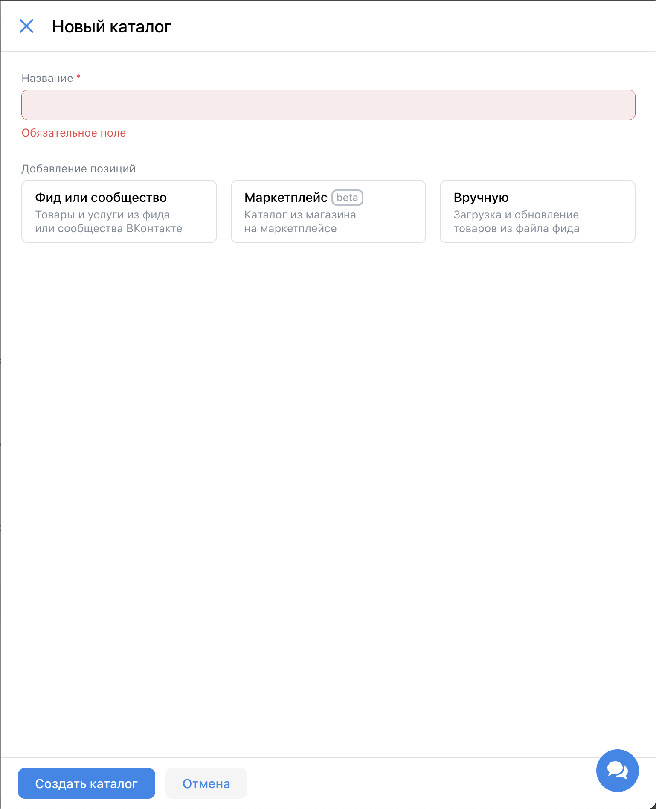

---

2.1. **Центр коммерции**. **Новый каталог**. **Добавление позиций**. При выборе *"Фид и сообщество"* появляются уточняющие поля: *"Ссылка на фид или сообщество"*, *"Период обновления"*, *"Автоматически удалять UTM-метки"*.

  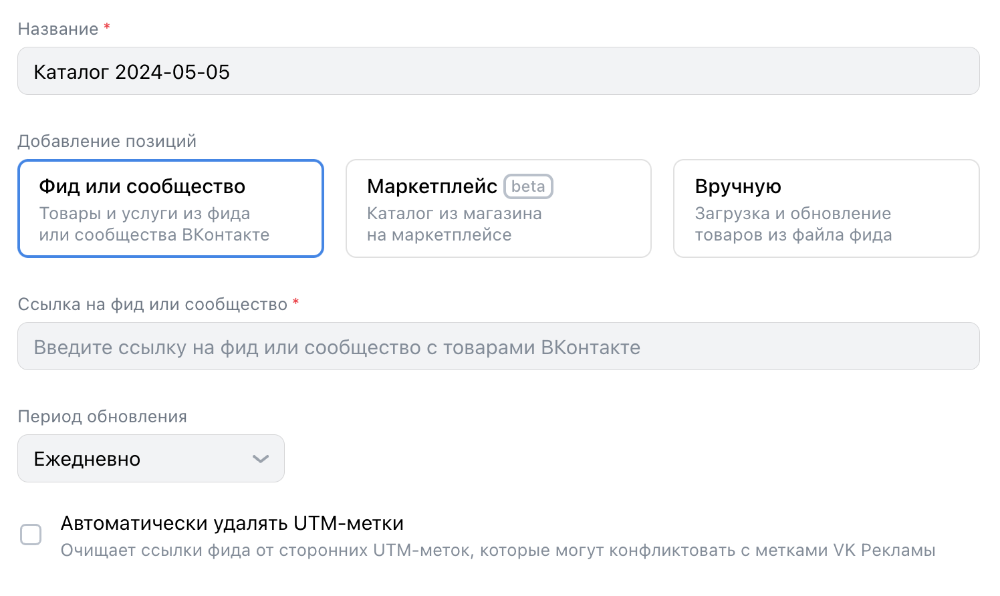

2.2. **Центр коммерции**. **Новый каталог**. **Добавление позиций**. При выборе *"Маркетплейс"* появляется уточняющее поле: *"Ссылка на страницу продавца"*.

  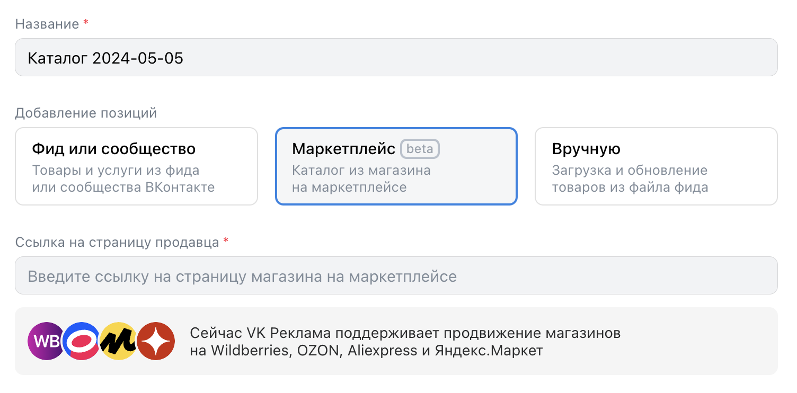

2.3. **Центр коммерции**. **Новый каталог**. **Добавление позиций**. При выборе *"Вручную"* появляются уточняющие поля: *"Категория фида"*, *"Файл фида"*,  *"Автоматически удалять UTM-метки"*.

  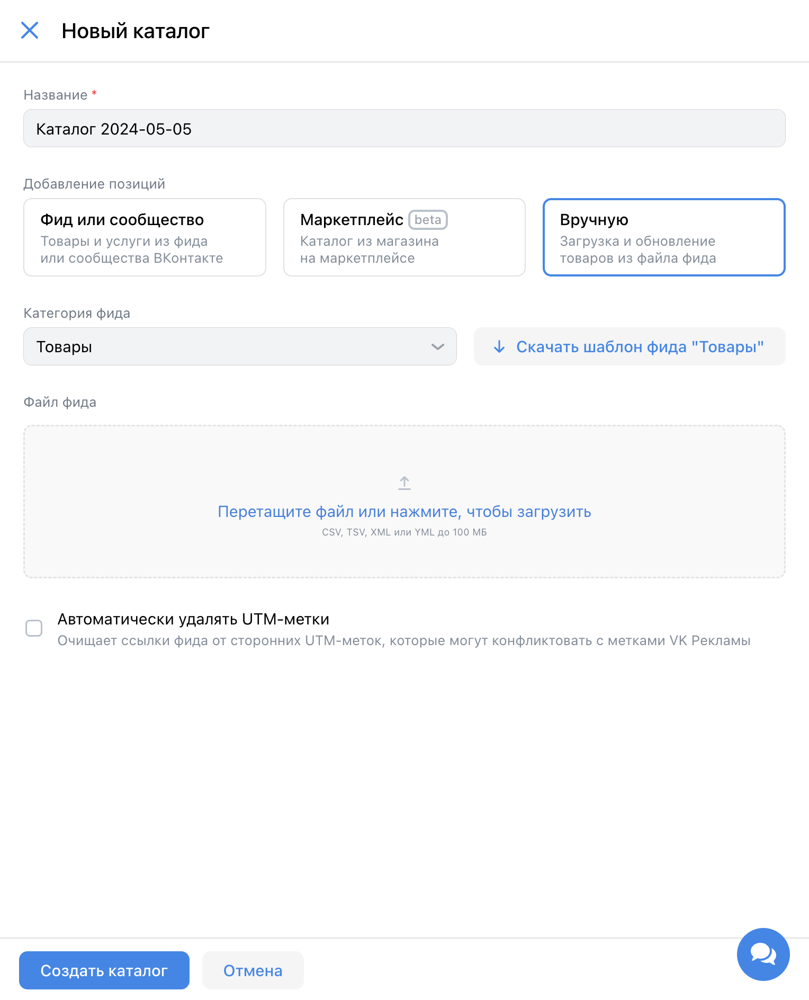

---

3.1. **Центр коммерции**. **Новый каталог**. **Добавление позиций**. **Фид и сообщество**. При вводе в инпут-поле *"Ссылка на фид или сообщество"* пустой строки и дальнейшем нажатии на кнопку *"Создать каталог"* под полем высвечивается ошибка: "Обязательное поле" и само инпут-поле приобретает красный цвет.

  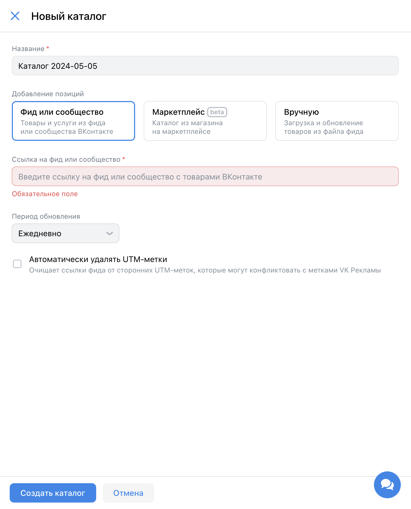

3.2. **Центр коммерции**. **Новый каталог**. **Добавление позиций**. **Фид и сообщество**. При вводе в инпут-поле *"Ссылка на фид или сообщество"* текста, не являющегося ссылкой и дальнейшем нажатии на кнопку *"Создать каталог"* под полем высвечивается ошибка: "Необходимо указать протокол http(s)" и само инпут-поле приобретает красный цвет.

  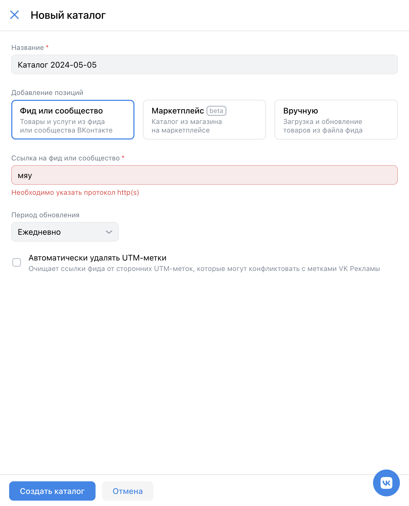

3.3. **Центр коммерции**. **Новый каталог**. **Добавление позиций**. **Фид и сообщество**. При вводе в инпут-поле *"Ссылка на фид или сообщество"* ссылки на сообщество Вконтакте, в котором добавлено меньше трех товаров, и дальнейшем нажатии на кнопку *"Создать каталог"* под полем высвечивается ошибка: "В этом сообществе недостаточно товаров или услуг. Добавьте минимум 3 товара или услуги, чтобы начать продвижение".

  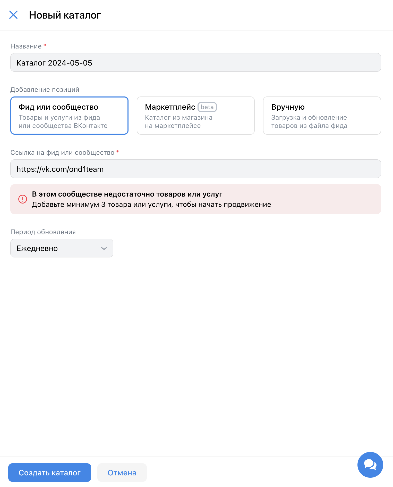

3.4. **Центр коммерции**. **Новый каталог**. **Добавление позиций**. **Фид и сообщество**. При вводе в инпут-поле *"Ссылка на фид или сообщество"* валидной ссылки на сообщество Вконтакте, в котором добавлено более трех товаров, и дальнейшем нажатии на кнопку *"Создать каталог"* откроется страница "История загрузок", где будет информация о отправленных заявках.

  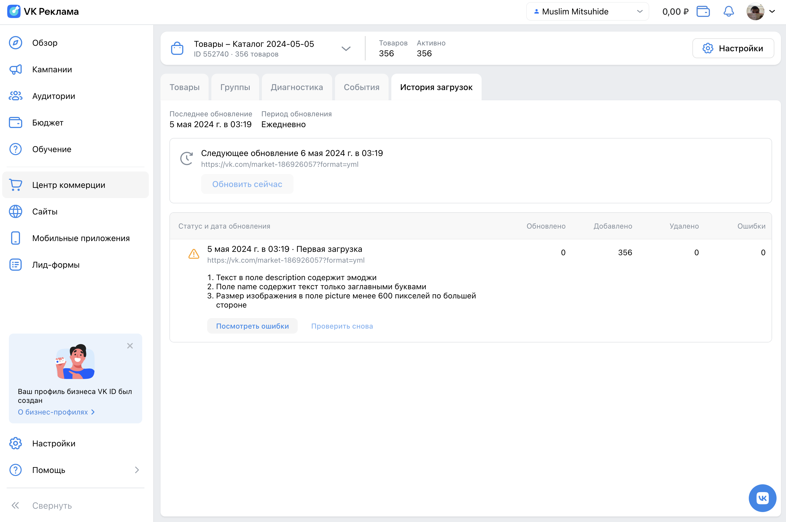

--- 

4.1. **Центр коммерции**. **Новый каталог**. **Добавление позиций**. **Маркетплейс**. При вводе в инпут-поле *"Ссылка на страницу продавца"* пустой строки и дальнейшем нажатии на кнопку *"Создать каталог"* под полем высвечивается ошибка: "Обязательное поле" и само инпут-поле приобретает красный цвет.

  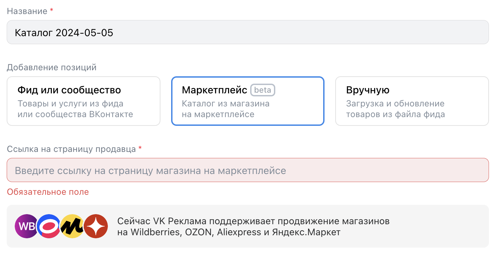

4.2. **Центр коммерции**. **Новый каталог**. **Добавление позиций**. **Маркетплейс**.
При вводе в инпут-поле *"Ссылка на страницу продавца"* текста, не являющегося ссылкой и дальнейшем нажатии на кнопку *"Создать каталог"* под полем высвечивается ошибка: "Необходимо указать протокол http(s)" и само инпут-поле приобретает красный цвет.

  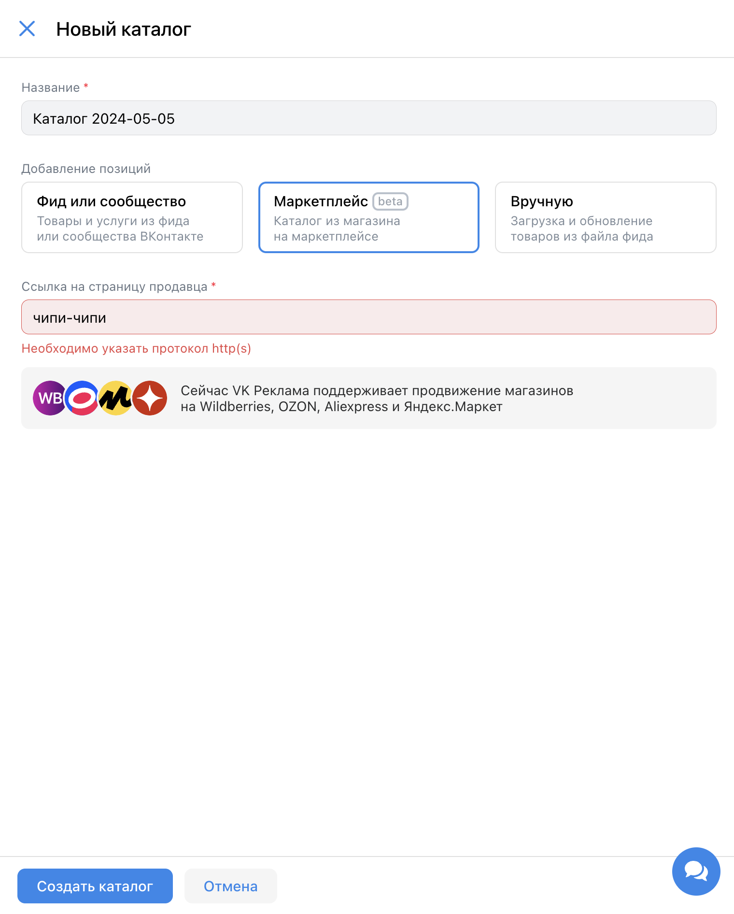

4.3.1. **Центр коммерции**. **Новый каталог**. **Добавление позиций**. **Маркетплейс**.
При вводе в инпут-поле *"Ссылка на страницу продавца"* валидной ссылки на продавца Wildberries и дальнейшем нажатии на кнопку *"Создать каталог"* появляются дополнительные уточняющие поля: *"API key"* и *"Период обновления"*.

  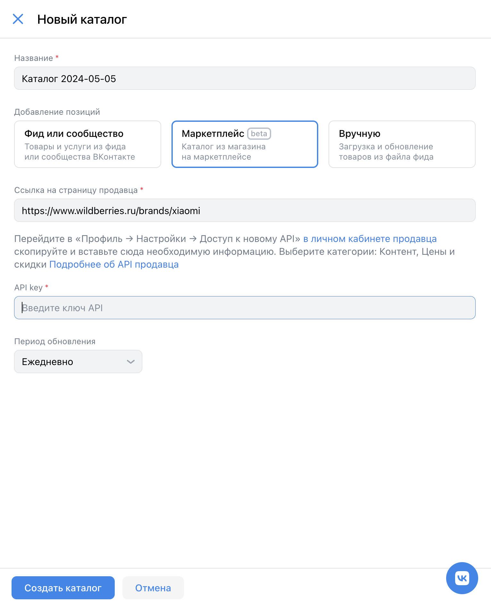

4.3.2. **Центр коммерции**. **Новый каталог**. **Добавление позиций**. **Маркетплейс**.
При вводе в инпут-поле *"API key"* пустой строки и дальнейшем нажатии на кнопку *"Создать каталог"* под полем высвечивается ошибка: "Обязательное поле" и само инпут-поле приобретает красный цвет.

  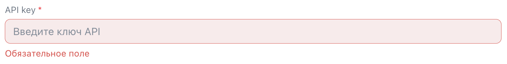

4.3.3. **Центр коммерции**. **Новый каталог**. **Добавление позиций**. **Маркетплейс**.
При вводе в инпут-поле *"API key"* строки символов, не являющихся ключом, и дальнейшем нажатии на кнопку *"Создать каталог"* под полем высвечивается ошибка: "Для создания каталога необходимо выбрать категории токена "Контент и Цены и скидки"" и само инпут-поле приобретает красный цвет.

  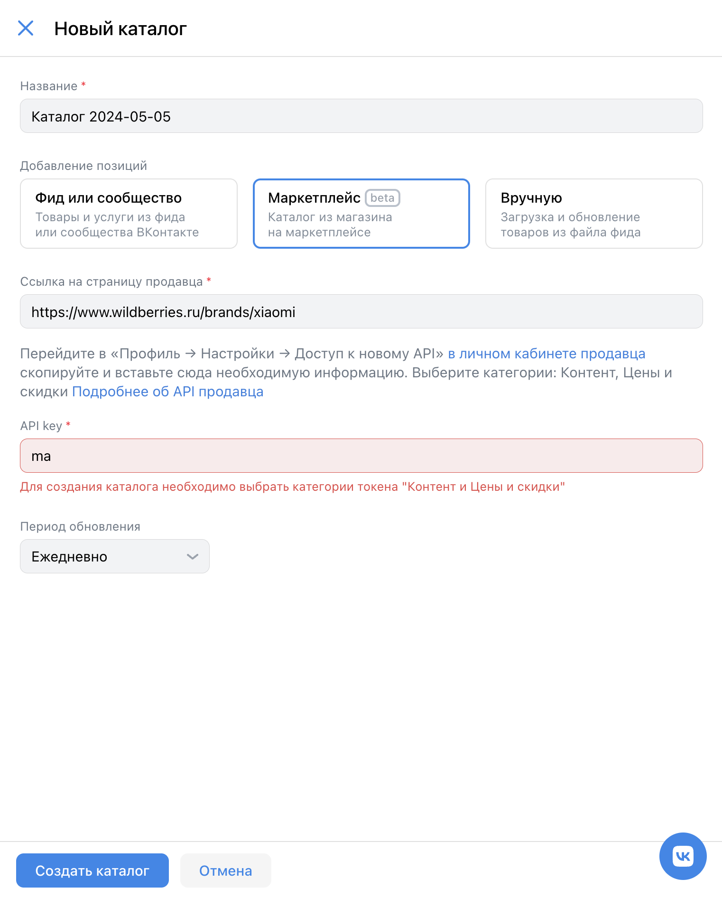

4.4.1. **Центр коммерции**. **Новый каталог**. **Добавление позиций**. **Маркетплейс**.
При вводе в инпут-поле *"Ссылка на страницу продавца"* валидной ссылки на продавца Ozon и дальнейшем нажатии на кнопку *"Создать каталог"* появляются дополнительные уточняющие поля: *"Client ID"*, *"API key"* и *"Период обновления"*.

  

4.4.2. **Центр коммерции**. **Новый каталог**. **Добавление позиций**. **Маркетплейс**.
При вводе в инпут-поля *"Client ID"* и *"API key"* пустых строк и дальнейшем нажатии на кнопку *"Создать каталог"* под полями высвечивается ошибка: "Обязательное поле" и сами инпут-поля приобретают красный цвет.

  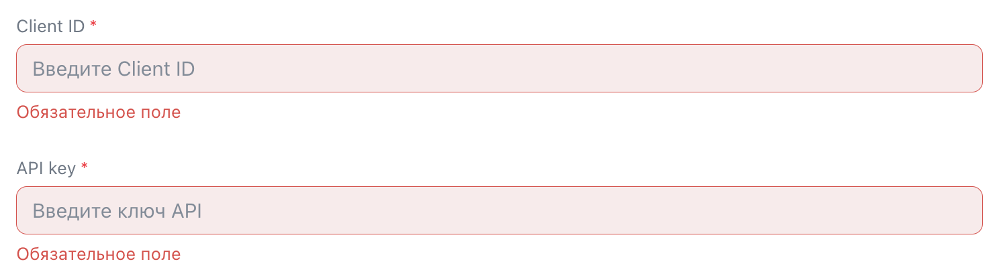

4.4.3. **Центр коммерции**. **Новый каталог**. **Добавление позиций**. **Маркетплейс**.
При вводе в инпут-поля *"API key"* неверного ключа и дальнейшем нажатии на кнопку *"Создать каталог"* под полем высвечивается ошибка: "Указан неверный ключ" и само инпут-поле приобретает красный цвет.

  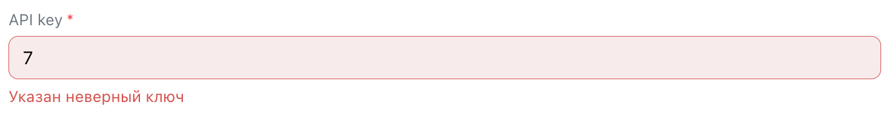

4.5.1. **Центр коммерции**. **Новый каталог**. **Добавление позиций**. **Маркетплейс**.
При вводе в инпут-поле *"Ссылка на страницу продавца"* валидной ссылки на продавца Aliexpress и дальнейшем нажатии на кнопку *"Создать каталог"* появляются дополнительные уточняющие поля: *"Токен API"* и *"Период обновления"*.

  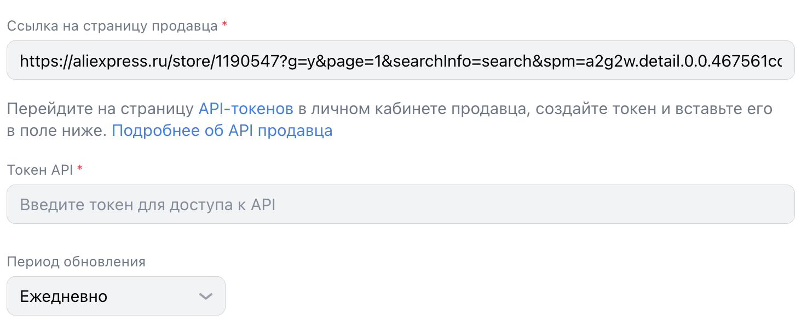

4.5.2. **Центр коммерции**. **Новый каталог**. **Добавление позиций**. **Маркетплейс**.
При вводе в инпут-поле *"Токен API"* пустой строки и дальнейшем нажатии на кнопку *"Создать каталог"* под полем высвечивается ошибка: "Обязательное поле" и само инпут-поле приобретает красный цвет.

  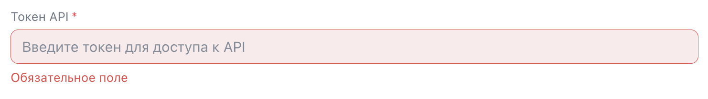

4.5.3. **Центр коммерции**. **Новый каталог**. **Добавление позиций**. **Маркетплейс**.
При вводе в инпут-поле *"Токен API"* неверного ключа и дальнейшем нажатии на кнопку *"Создать каталог"* под полем высвечивается ошибка: "String is not compatible with encoding" и само инпут-поле приобретает красный цвет.

  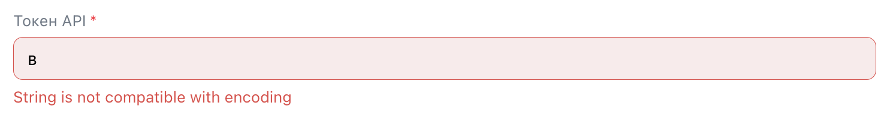

4.6.1. **Центр коммерции**. **Новый каталог**. **Добавление позиций**. **Маркетплейс**.
При вводе в инпут-поле *"Ссылка на страницу продавца"* валидной ссылки на продавца Яндекс.Маркет и дальнейшем нажатии на кнопку *"Создать каталог"* появляется кнопка "Предоставить доступ", **которая должна производить редирект по ссылке** и дополнительное уточняющее поле: *"Период обновления"*.

  

--- 

5.1. **Центр коммерции**. **Новый каталог**. **Добавление позиций**. **Вручную**. При отсутствии загруженного файла в поле *"Файл фида"* и дальнейшем нажатии на кнопку *"Создать каталог"* под полем высвечивается ошибка: "Обязательное поле".

  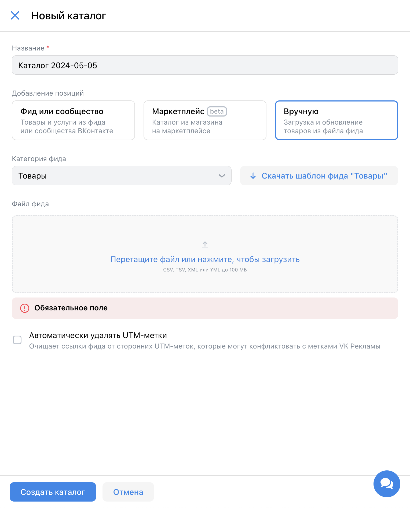

--- 
### Баги

Во время тестирования данного раздела VK Рекламы были обнаружены следующие баги: 

1.  **Центр коммерции. Создать каталог.** При вводе любого валидного названия в инпут-поле "Название" и дальнейшем нажатии на кнопку "Создать каталог" при невыбранной позиции из "Добавление позиций" ничего не происходит, хотя ожидается сообщение с ошибкой, либо деактивация кнопки "Создать каталог" до выбора позиции.

  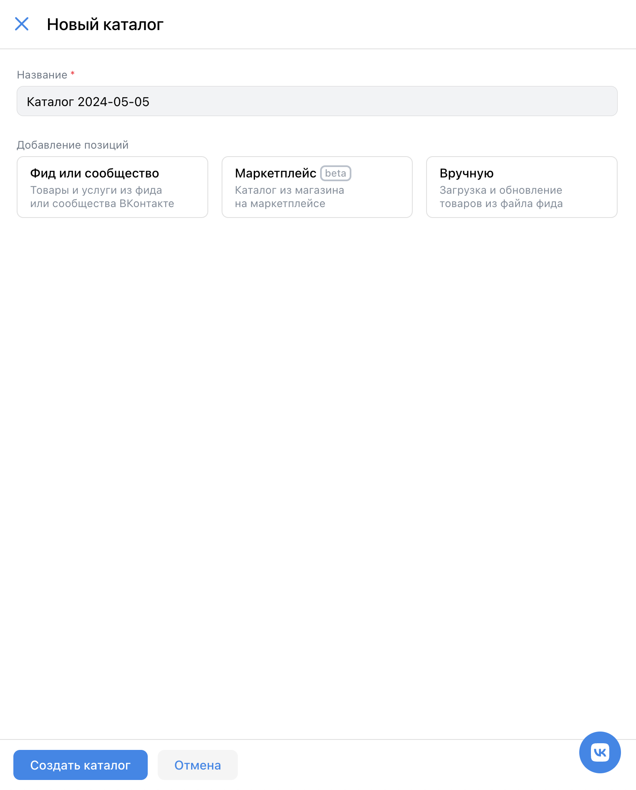

2. **Центр коммерции. Создать каталог. Маркетплейс** При вводе валидной ссылки на продавца Яндекс.Маркет в инпут-поле "Ссылка на страницу продавца" и дальнейшем нажатии на кнопку "Предоставить доступ" ничего не происходит, хотя ожидается редирект по какой-то ссылке, где пользователь сможет предоставить доступ, либо ожидается получение сообщения с ошибкой, если пользователь что-то сделал не так.

  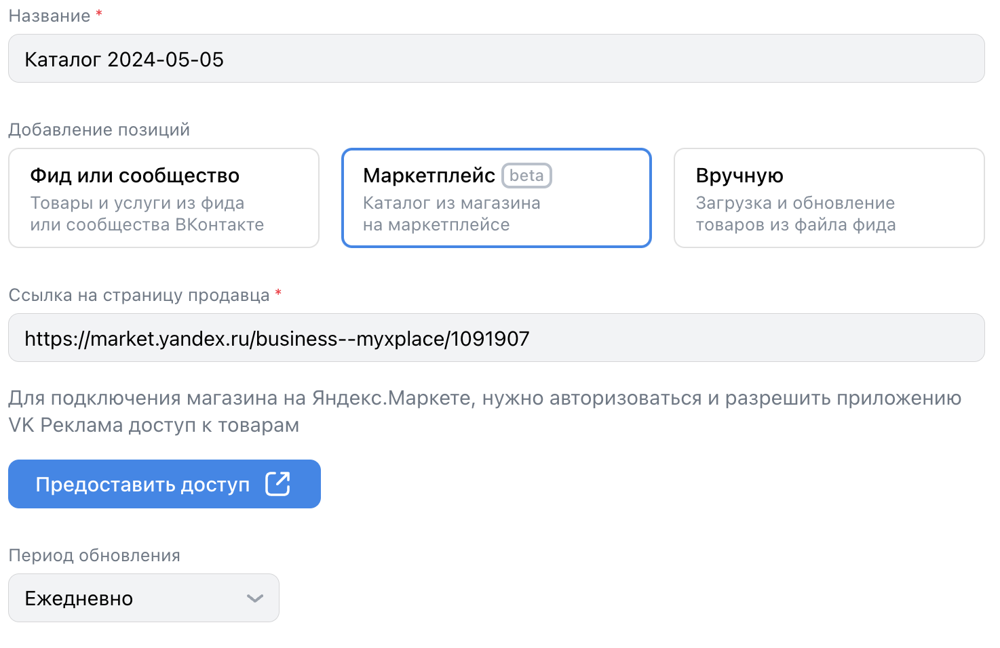

